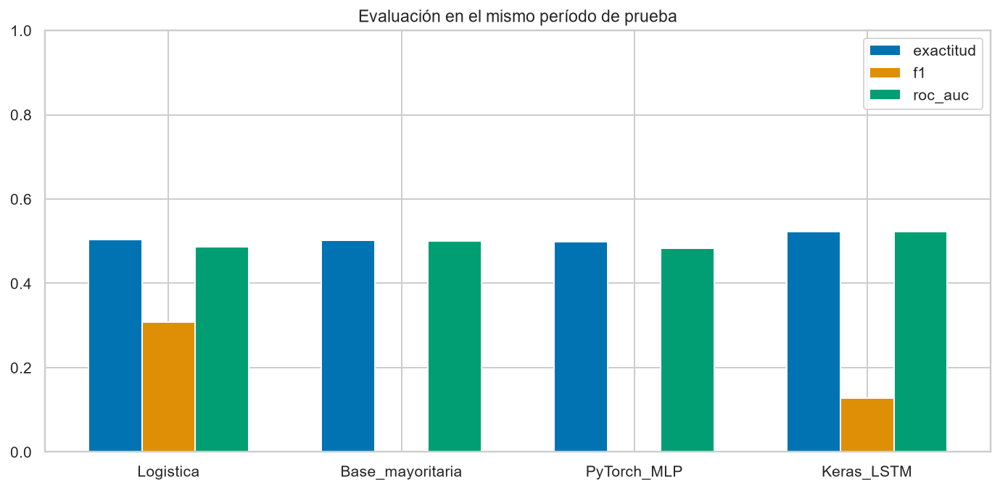
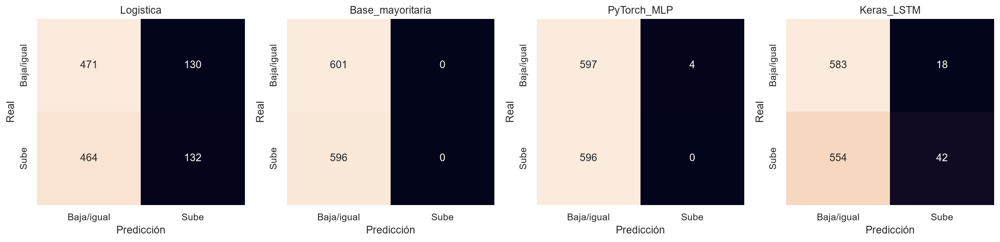
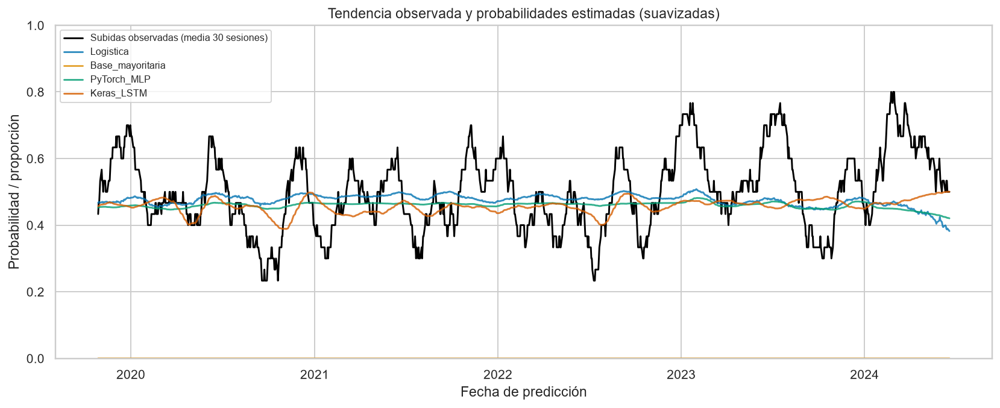
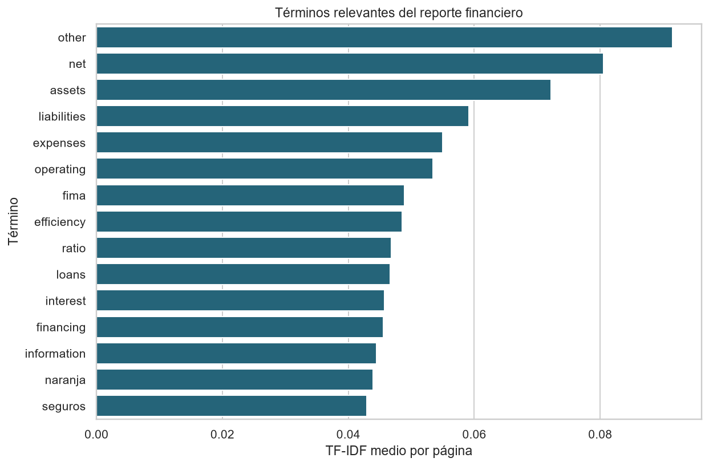
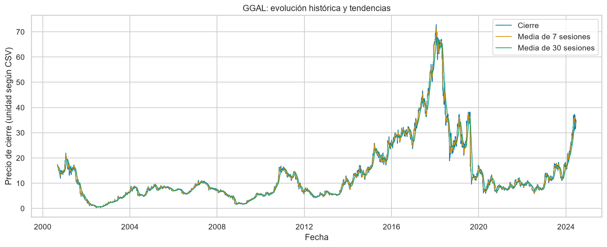
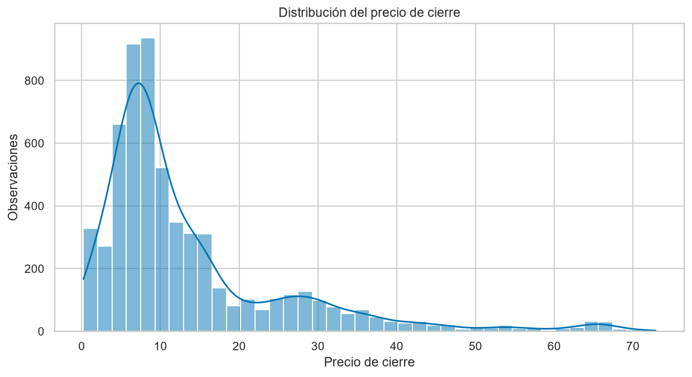
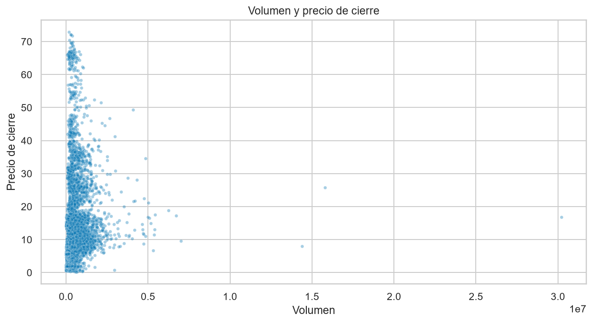

# Informe técnico: predicción de tendencias financieras con Python

Trabajo final PIAD-425. Ejecución: 2026-09-07T02:53:18.007067+00:00. Modo: **completo**.
Autor, instructor y datos académicos: completar por el estudiante.

## 1. Problema, objetivo y propuesta

La empresa del caso necesita transformar CSV, analizar tendencias, comparar modelos y
extraer información de reportes financieros. Se propone un flujo reproducible con
Pandas/NumPy, Scikit-learn, PyTorch, TensorFlow/Keras y NLTK/SciPy, que entrega
probabilidades, métricas, gráficos, modelos guardados y términos relevantes al analista.
Al terminar la sesión t, el objetivo es predecir si el cierre de la siguiente sesión
será mayor. No se predice un precio exacto ni se ejecutan operaciones bursátiles.

## 2. Datos y procedencia

El CSV recibido contiene 6014 filas de GGAL.
Su proveedor, licencia, moneda y tratamiento de ajustes corporativos no están
documentados: **la fuente original debe ser confirmada por el estudiante**.
No se atribuye a Kaggle o Yahoo sin evidencia. SHA-256: `2abdfcafbe15bcd1388fb37d251280cbb4bf2669da69411b340546d09b6af5ed`.
Se usa `close`, sin suponer que sea una serie de retorno total.
Un solo activo no representa todo el mercado.

NLP utiliza el reporte público real de Galicia de 2Q2024, publicado el 22/08/2024.
`datos/reportes/fuentes.json` identifica fecha, idioma y URL. Se analiza su texto inglés
por página. Es posterior al CSV y se estudia por separado: **no alimenta los predictores
bursátiles**. Solo se exportan derivados, no el texto íntegro.

## 3. Preparación y optimización

Se verifican columnas, tipos, fechas únicas, un ticker, finitud numérica, precios positivos,
volumen no negativo y consistencia OHLC. Se eliminan duplicados exactos y se rechazan
datos inválidos en vez de imputarlos silenciosamente. Se ordena cronológicamente.
Se construyen retornos, logaritmo del volumen, medias de 7/30 sesiones,
distancia relativa a esas medias y volatilidad de 7 sesiones.
NumPy calcula log1p, valida finitud y construye tensores; Pandas gestiona tablas y ventanas.
Las características se convierten a float32 y la etiqueta a int8.

Se descartan 30 filas entre duplicados, calentamiento y falta de cierre
futuro. Quedan 5984 observaciones, del 2000-09-05 al 2024-06-18.
El último registro no recibe una etiqueta ficticia. Las características ocupan
215424 bytes sin índice.

## 4. Validación temporal

| Conjunto | Filas | Inicio | Fin de características |
|---|---:|---|---|
| train | 3589 | 2000-09-05 | 2014-12-10 |
| val | 1196 | 2014-12-12 | 2019-09-13 |
| test | 1197 | 2019-09-17 | 2024-06-18 |

La división aproximada es 60/20/20. Se purga una fila en cada frontera para evitar que
una etiqueta futura alcance la fecha inicial del conjunto siguiente. Se ajusta el
escalador solo en entrenamiento. La logística elige C en tres particiones crecientes
TimeSeriesSplit, con gap=1 y pérdida logarítmica; C elegido: 10.0.
Las redes seleccionan pesos por pérdida de validación, con parada temprana de paciencia 5.
La prueba final no ajusta hiperparámetros.

La LSTM recibe ventanas de 20 sesiones terminadas en t. Las ventanas iniciales
de validación/prueba pueden usar contexto anterior, disponible al predecir. Todos los
modelos se evalúan en las mismas fechas de prueba. La LSTM omite las primeras ventana-1
filas de entrenamiento por falta de contexto. No se selecciona un ganador con prueba.

## 5. Modelos

- Referencia mayoritaria: clase más frecuente de entrenamiento, sin consultar prueba.
- Regresión logística: nueve variables normalizadas y C seleccionado temporalmente.
- PyTorch: MLP 9-32-16-1 con ReLU, logits, BCEWithLogitsLoss, Adam y regularización
  de pesos 0.001. Estado: Ejecutado.
- TensorFlow/Keras: LSTM de 16 unidades, capa densa de 8, salida sigmoide,
  entropía cruzada binaria y Adam. Estado: Ejecutado.

Semilla 42, hasta 30 épocas, lotes de 64 y CPU con dos hilos
por framework. Umbral fijo 0.5. `modelos/` guarda modelos, pesos y escaladores.
Las versiones reales están en `resumen.json`; `requirements-lock.txt` fija el entorno verificado.

## 6. Resultados de prueba e interpretación

| Modelo | Exactitud | Precision | Recall | F1 | ROC-AUC | Log loss |
|---|---:|---:|---:|---:|---:|---:|
| Logistica | 50.38% | 0.5038 | 0.2215 | 0.3077 | 0.4862 | 0.6998 |
| Base_mayoritaria | 50.21% | 0.0000 | 0.0000 | 0.0000 | 0.5000 | 17.9465 |
| PyTorch_MLP | 49.87% | 0.0000 | 0.0000 | 0.0000 | 0.4832 | 0.6972 |
| Keras_LSTM | 52.21% | 0.7000 | 0.0705 | 0.1280 | 0.5234 | 0.6949 |

- Logistica: +0.17 puntos porcentuales frente a la referencia mayoritaria.
- PyTorch_MLP: -0.33 puntos porcentuales frente a la referencia mayoritaria.
- Keras_LSTM: +2.01 puntos porcentuales frente a la referencia mayoritaria.

- Logistica: detectó 132 de 596 subidas reales (recall 22.15%).
- PyTorch_MLP: detectó 0 de 596 subidas reales (recall 0.00%).
- Keras_LSTM: detectó 42 de 596 subidas reales (recall 7.05%).

La detección de subidas debe leerse junto con la exactitud: acertar principalmente
bajadas no resuelve adecuadamente la identificación de oportunidades de subida.

Exactitud mide aciertos globales. Precision, recall y F1 corresponden a subida;
ROC-AUC mide ordenamiento probabilístico y log loss penaliza probabilidades equivocadas.
La referencia determinista puede tener log loss muy alta. Una diferencia pequeña no
demuestra significancia o utilidad económica. No hay backtest con costos y no se afirma
rentabilidad. Una red más compleja no implica automáticamente una mejora.





La curva observada es la proporción móvil de subidas frente a probabilidades medias en
30 sesiones. El suavizado es descriptivo: las métricas usan predicciones diarias originales.

## 7. NLP: extracción de información

pypdf extrae texto; RegexpTokenizer de NLTK tokeniza; una lista explícita filtra palabras
frecuentes. No se descargan corpus. TF-IDF representa páginas y SciPy almacena la matriz
CSR. Se detectan montos en millones de pesos y porcentajes, con página de origen.
Son candidatos de extracción, no estados contables interpretados: se debe revisar
la unidad, el concepto y el período de cada cifra.

Se analizaron 54 páginas, 3978 tokens filtrados y
806 términos distintos. La matriz dispersa ocupa
32800 bytes frente a 348192
bytes del equivalente denso float64. `nlp_paginas.csv` contiene cifras y términos por
página; `nlp_terminos.csv` contiene frecuencias y TF-IDF.

Se cumple la alternativa de **tokenización** del enunciado; no se presenta sentimiento
sin etiquetas como clasificador validado. El corpus es un reporte, no una muestra
representativa de todas las comunicaciones de la compañía.



## 8. Visualización

Matplotlib y Seaborn generan líneas y medias móviles, histogramas, dispersión,
distribución de clases, matrices, comparación de métricas, tendencias predichas,
curvas de aprendizaje y términos financieros. Los PNG se guardan sin abrir ventanas.





## 9. Preguntas guía

**1. ¿Cómo optimizar estructuras con Pandas y NumPy?**
Vectorizar operaciones, elegir tipos y usar ventanas en vez de bucles por fila.
Aquí se usan float32/int8, log1p y matrices NumPy. Para datos mayores se puede leer
por bloques y limitar columnas; es una ampliación, no una mejora ya medida aquí.

**2. ¿Qué técnicas pueden mejorar la predicción?**
Comparar referencias, modelos lineales y redes en el mismo período; ajustar parámetros
en el pasado y controlar sobreajuste. El proyecto implementa esta comparación.
La mejora debe demostrarse en datos independientes, no asumirse por complejidad.

**3. ¿Cómo extraer información con NLP?**
Separar unidades trazables, tokenizar, filtrar, representar TF-IDF y localizar cifras
con contexto. Es el flujo implementado. Sentimiento futuro requeriría etiquetas,
negaciones y vocabulario financiero, además de evaluación de sus errores.

**4. ¿Cómo influye Deep Learning en decisiones empresariales?**
Modela relaciones no lineales y secuencias. Aquí entrega probabilidades para revisión
humana. Su adopción depende de mejora verificable, estabilidad, costo y explicación;
estos resultados no justifican automatizar inversiones.

**5. ¿Qué herramientas mejoran la interpretación?**
Pandas resume, Matplotlib controla la composición y Seaborn facilita distribuciones.
Líneas muestran evolución, histogramas distribución, dispersión asociaciones y
matrices de confusión los tipos de error.

## 10. Arquitectura y ejecución

```text
CSV -> validación -> indicadores -> división temporal -> escalado
                                           |-> logística + referencia
                                           |-> MLP PyTorch
                                           |-> ventanas -> LSTM Keras
                                           v
                                  evaluación común y gráficos
PDF + fuente -> texto -> NLTK -> TF-IDF/SciPy -> tablas NLP
                                           |
                                           v
                                 informe, métricas y modelos
```

1. Crear entorno e instalar `requirements-lock.txt` o `requirements.txt`.
2. Conservar datos y manifiesto; ejecutar `python -m unittest discover -s tests -v`.
3. Ejecutar `python main.py --epochs 30`.
4. Revisar `COMPLETADO.json`, `resumen.json`, predicciones e informe.

El modo base es diagnóstico y no acredita las redes. Solo una corrida exitosa crea
`COMPLETADO.json`; al iniciar se elimina el marcador previo. No atribuir archivos
antiguos a una ejecución fallida.

## 11. Normas técnicas, seguridad, salud y medio ambiente

Se aplican validación, trazabilidad, registro de versiones y pruebas; no se afirma una
certificación normativa. Se trabaja con información pública y sin credenciales o datos
de clientes. Solo cargar modelos de fuentes confiables.
Mantener postura/pantalla adecuadas y pausas periódicas durante el desarrollo.
Redes pequeñas, hilos acotados y parada temprana limitan recursos. Reutilizar resultados
evita entrenamientos innecesarios; la entrega digital evita impresiones.

## 12. Evidencia de cumplimiento y limitaciones

| Requisito | Evidencia |
|---|---|
| CSV, Pandas, NumPy | `mercado/datos.py`, datos preparados |
| Scikit-learn y validación | `mercado/modelos.py`, validación cruzada |
| PyTorch | MLP y pesos; Ejecutado |
| TensorFlow/Keras y series | LSTM con ventanas; Ejecutado |
| NLTK, SciPy, extracción/tokenización | `mercado/nlp.py`, tablas y matriz CSR |
| Entrenamiento y evaluación | Métricas, predicciones, matrices, historiales |
| Matplotlib y Seaborn | Líneas, histogramas, dispersión y comparación |
| Informe, propuesta, preguntas y esquema | Este documento |

Pendiente externo: confirmar fuente/licencia del CSV y completar identificación académica.
No se inventan estos datos. El código rechaza múltiples tickers para no mezclar activos.
Generalizar requiere evaluar nuevos activos/períodos. No se midió significancia
estadística ni costos de operación.

## 13. Referencias

- Enunciado PIAD-425_TRABAJOFINAL (1).pdf, páginas 2-4, proporcionado por el estudiante.
- [Reporte Galicia](https://gfgsa-stag.s3.amazonaws.com/app/uploads/2024/08/22204706/Press_Release_GFG_2Q2024_EN.pdf).
- [TimeSeriesSplit](https://scikit-learn.org/stable/modules/generated/sklearn.model_selection.TimeSeriesSplit.html).
- [Keras LSTM](https://www.tensorflow.org/api_docs/python/tf/keras/layers/LSTM).
- [PyTorch BCEWithLogitsLoss](https://docs.pytorch.org/docs/stable/generated/torch.nn.BCEWithLogitsLoss.html).
- [NLTK](https://www.nltk.org/api/nltk.tokenize.html).
- [SciPy sparse](https://docs.scipy.org/doc/scipy/reference/sparse.html).
